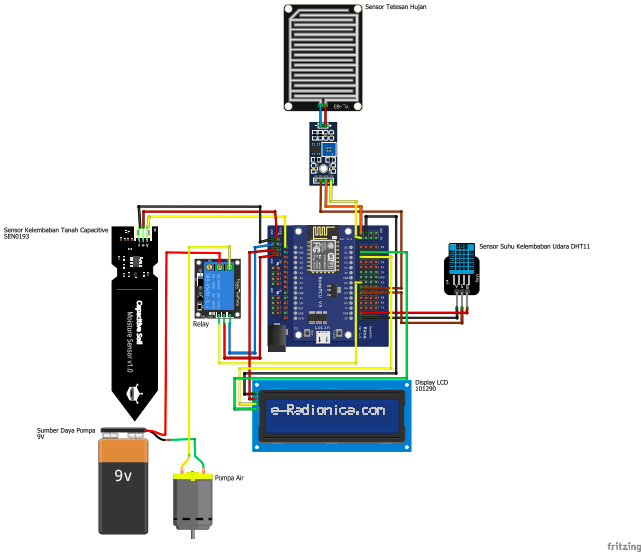

# Farm-Monitoring-and-Controlling-Sytem-With-Blynk

This project is a part of the Community Service Program I participated in while I was in college. It is a simple device that can perform real-time monitoring and control through the Blynk platform, specifically designed for agricultural applications. The primary goal of this project was to provide an efficient solution for monitoring soil moisture levels, controlling water pumps, detecting rainfall, and displaying real-time data, thereby optimizing irrigation practices for local farmers.

# Project Overview
The device is equipped with several sensors that measure key environmental parameters:

- Soil Moisture Sensor: Measures the moisture content in the soil to determine when irrigation is needed.
- DHT11 Sensor: Measures temperature and humidity, providing additional context for the environmental conditions affecting crop growth.
- Raindrop Sensor: Detects rainfall, allowing the system to adjust irrigation schedules based on current weather conditions.
- LCD Display: Shows real-time data from the sensors, including soil moisture levels, temperature, humidity, and rainfall status.


This data is sent to the Blynk application, allowing farmers to monitor soil and environmental conditions in real-time from their smartphones or tablets. Additionally, the system enables users to control water pumps remotely, ensuring that crops receive adequate irrigation without the need for constant manual intervention.

# Key Features
- Real-Time Soil Monitoring: The device continuously collects data from the soil moisture, DHT, and raindrop sensors, updating the Blynk app and the LCD display to provide farmers with current information about soil and environmental conditions.

- Automated Water Pump Control: Users can set thresholds for soil moisture levels. The system will automatically activate or deactivate the water pump based on these readings, ensuring optimal irrigation. If rain is detected, the system can also pause irrigation to conserve water.

- Notifications: Farmers receive alerts on their mobile devices when soil moisture levels fall below a certain threshold or when rain is detected, allowing for timely irrigation adjustments and preventing crop stress.

- Implementation
The project was implemented using an ESP8266 microcontroller, which provides built-in Wi-Fi capabilities for seamless connectivity to the Blynk platform. The sensors and components used in the project include:
### **System Diagram**:  

<p align="center">
    
</p>


### **Prerequisites**:
1. Install **Arduino IDE**.  
2. Download the required libraries:
   - `ESP8266WiFi`  
   - `BlynkSimpleEsp8266`  
   - `DHT`  
   - `LiquidCrystal_I2C`  
   - `NTPClient`  
   - `TimeLib`  

### **Steps to Install**:
1. Clone this repository:
   ```bash
   git clone https://github.com/your-username/smart-farm-talang-jawa.git
   cd smart-farm-talang-jawa
   ```
2. Open the .ino file in Arduino IDE.
3. Configure the Wi-Fi and Blynk credentials in the code:
   ```cpp
    char ssid[] = "Your_WiFi_Name";
    char pass[] = "Your_WiFi_Password";
    char auth[] = "Your_Blynk_Auth_Token";
   ```
4. Select the correct Board (NodeMCU 1.0) and COM Port in the Arduino IDE.
5. Upload the code to your ESP8266 board.
6. Open the Blynk app, set up widgets, and link it to your device.
